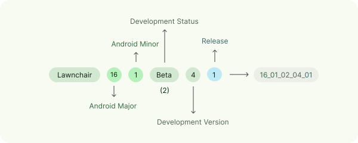

# Lawnchair contributing guidelines

<picture>
    <!-- Workaround to prevent the image from being clickable -->
    <source media="(prefers-color-scheme: dark)" srcset="docs/assets/lawnchair-round.webp" width="100">
    
</picture>

Welcome to the **Lawnchair** project. We appreciate your interest in contributing. If you have
questions,
feel free to reach out on [Telegram][telegram] or [Discord][discord].

## No-code contributions

- For **[bug reports][bug-reports]**, please be as detailed as possible and provide clear steps to
  reproduce the issue.
- For **[feature requests][feature-requests]**, clearly describe the feature and its potential
  benefits.
- For security vulnerabilities, follow the instructions in our [Security Policy][security-policy]
- For translations, visit **[Lawnchair on Crowdin][crowdin]**.
- For documentation, follow
  the [developer documentation style guide](https://developers.google.com/style) of Google.

**Tips for contributing**

- Follow our [Code of Conduct][code-of-conduct].
- Use Lawnchair's [Nightly builds][nightly] before creating issues.

## Contributing code

### Getting started

1. Clone the repository with the `--recursive` flag to include the project's submodules:
   ```bash
   git clone --recursive https://github.com/LawnchairLauncher/lawnchair.git
   ```
2. Open the project in Android Studio.
3. Select the `lawnWithQuickstepGithubDebug` build variant.

If you encounter errors with modules that end with the `lib` suffix, such as `iconloaderlib` or
`searchuilib`, run `git submodule update --init --recursive`.

Here are some contribution tips to help you get started:

- Ensure you are up to date with **Lawnchair** by setting your base branch to `16-dev`.
- Make sure your code is logical and formatted correctly. For Kotlin, see
  the [Kotlin coding conventions][kotlin-coding-conventions].
- [The `lawnchair` package][lawnchair-package] houses Lawnchair’s own code, whereas [the
  `src` package][src-package] includes a clone of the Launcher3 codebase with modifications.
  Generally, place new files in the former and keep changes to the latter to a minimum.

### Additional documentation

- [Roadmap](ROADMAP.md)
- [Wiki](https://github.com/LawnchairLauncher/lawnchair/wiki)
- [Visual guidelines](/docs/assets/README.md)
- [`compatLib` module](compatLib/README.md)
- [`preferences` directory](lawnchair/src/app/lawnchair/ui/preferences/components/README.md)
- [`libs/systemui` framework module](platform_frameworks_libs_systemui/README.md)
- [`packages/SystemUI` app](systemUI/README.md)
- [Prebuilt libraries](prebuilts/libs/README.md)

### Development workflow

We use a tiered workflow to balance development speed with stability. The process for merging a
change depends on its complexity and risk. All PRs should target the `16-dev` branch.

| Tier                        | Definition                                                                                | Examples                                                                                | Protocol                                                                                                                                                                                                  |
|-----------------------------|-------------------------------------------------------------------------------------------|-----------------------------------------------------------------------------------------|-----------------------------------------------------------------------------------------------------------------------------------------------------------------------------------------------------------|
| Trivial changes             | Changes with zero risk of functional regression.                                          | Fixing typos in comments or UI text (`docs`, `fix`), simple code style fixes (`style`). | Commit **directly** to the active branch.                                                                                                                                                                 |
| Simple, self-contained work | Changes that are functionally isolated and have a very low risk of side effects.          | Most single-file bug fixes, minor UX polish (padding, colors).                          | 1. Create a Pull Request.<br>2. Assign a reviewer.<br>3. Enable **"Auto-merge"** on the PR. It will merge automatically after CI passes and a reviewer approves.                                          |
| Medium complexity features  | New features or changes that affect multiple components but are not deeply architectural. | A new settings screen, a new drawer search provider                                     | 1. Create a detailed Pull Request.<br>2. Assign the core team for review.                                                                                                                                 |
| Major architectural changes | High-risk, complex changes that affect the core foundation of the app.                    | Android version rebase                                                                  | 1. Create a very detailed Pull Request.<br>2. **Mandatory Review:** You **must** wait for at least one formal approval from a key team member before merging. The "Merge on Silence" rule does not apply. |

### Commit message convention

We follow the **[Conventional Commits specification][conventional-commits]**.

* **Format:** `type(scope): subject`
* **Example:** `feat(settings): Add toggle for new feature`
* **Allowed types:** `feat`, `fix`, `style`, `refactor`, `perf`, `docs`, `test`, `chore`.

### Versioning scheme

Lawnchair’s version code is composed of five parts, separated by underscores:

<p align="center">
    <picture>
        <source media="(prefers-color-scheme: dark)" srcset="docs/assets/version-dark.svg" width="98%">
        
        <!-- Direct the accessibility reader to read the point below --->
    </picture>
</p>

1. Android major version
2. Android minor version
3. Lawnchair development stage
4. Lawnchair development version
5. Revision/Release number

#### Lawnchair development stages

The following table lists the development stages used by Lawnchair:

| Stage             | Denote |
|-------------------|--------|
| Development       | 00     |
| Alpha             | 01     |
| Beta              | 02     |
| Release Candidate | 03     |
| Release           | 04     |

### `strings.xml` naming

String `name` attributes in `strings.xml` should follow this format:

| Type                                             | Format            | Example usage              | Actual string        | Other information                                                                                  |
|--------------------------------------------------|-------------------|----------------------------|----------------------|----------------------------------------------------------------------------------------------------|
| Generic word                                     | $1                | `disagree_or_agree`        | Disagree or agree    | Should only be used if it doesn't fit the categories below.                                        |
| Action                                           | $1_action         | `apply_action`             | Apply                | Any generic action verb fits here.                                                                 |
| Preference or popup label<br/>Preference headers | $1_label          | `folders_label`            | Folders              |                                                                                                    |
| Preference or popup description                  | $1_description    | `folders_description`      | Row and column count |                                                                                                    |
| Preference choice                                | $1_choice         | `off_choice`               | Off                  |                                                                                                    |
| Feature string                                   | (feature_name)_$1 | `colorpicker_hsb`          | HSB                  | Feature strings are confined to a specific feature. Examples include the gesture and color picker. |
| Launcher string                                  | $1_launcher       | `device_contacts_launcher` | Contacts from device | Strings that are specific to the Launcher area.                                                    |

### Updating the locally stored Google Fonts listing

Lawnchair uses a locally stored JSON file (`google_fonts.json`) to list available fonts from Google
Fonts. This file should be updated periodically or before a release.

To update the font listing, follow these steps:

1. Obtain a [Google Fonts Developer API key][google-fonts-api-key].
2. Download the JSON file from `https://www.googleapis.com/webfonts/v1/webfonts?key=API_KEY`,
   replacing `API_KEY` with your key.
3. Replace the content of [`google_fonts.json`](lawnchair/assets/google_fonts.json) with the API
   response.

<!-- Links -->
[telegram]: https://t.me/lccommunity
[discord]: https://discord.com/invite/3x8qNWxgGZ
[nightly]: https://github.com/LawnchairLauncher/lawnchair/releases/tag/nightly
[security-report]: https://github.com/LawnchairLauncher/lawnchair/security/advisories/new
[security-policy]: https://github.com/LawnchairLauncher/lawnchair/security/policy
[bug-reports]: https://github.com/LawnchairLauncher/lawnchair/issues/new?assignees=&labels=bug&projects=&template=bug_report.yaml&title=%5BBUG%5D+
[feature-requests]: https://github.com/LawnchairLauncher/lawnchair/issues/new?assignees=&labels=feature%2Cenhancement&projects=&template=feature_request.yaml&title=%5BFEATURE%5D+
[code-of-conduct]: CODE_OF_CONDUCT.md
[crowdin]: https://lawnchair.crowdin.com
[kotlin-coding-conventions]: https://kotlinlang.org/docs/coding-conventions.html
[lawnchair-package]: https://github.com/LawnchairLauncher/lawnchair/tree/16-dev/lawnchair
[src-package]: https://github.com/LawnchairLauncher/lawnchair/tree/16-dev/src
[conventional-commits]: https://www.conventionalcommits.org/en/v1.0.0/
[google-fonts-api-key]: https://developers.google.com/fonts/docs/developer_api#APIKey
